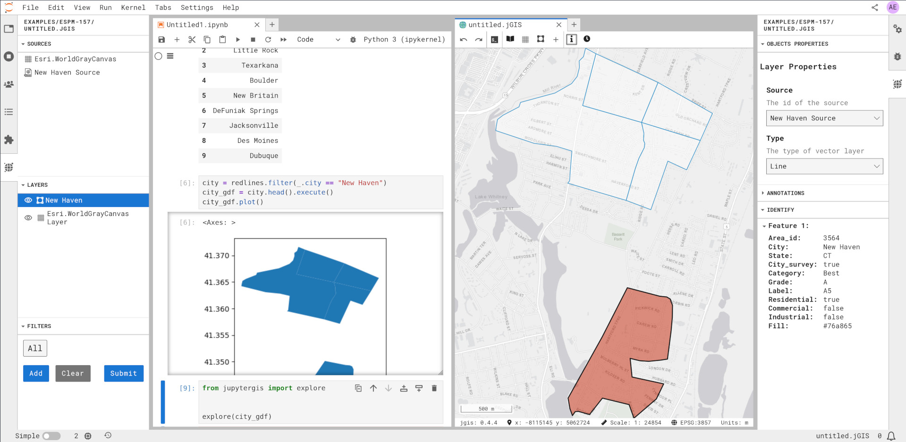

[QGIS](https://qgis.org/) is a widely-loved, free, and open source graphical
desktop environment for geospatial visualization and analysis.
In contrast with the broad and deep ecosystem of programming-based geospatial tools,
QGIS is simple to use and empowers practitioners to focus on their goals.

In GeoJupyter's [user interviews](/interviews), geospatial data practitioners identified
a pattern of **bouncing between a scripting environment for analysis and a graphical
environment for data validation**.

We call this pattern :woman_dancing: **_The QGIS Bounce_** :man_dancing:.

This pattern of transferring data between environments  was represented by users as a
point of repeated friction.
We think we can improve on this with a tightly integrated collaborative GIS environment
in JupyterLab, [**JupyterGIS**](https://github.com/geojupyter/jupytergis).


## :shrug: How do I do :woman_dancing: **_The QGIS Bounce_** :man_dancing: ?

There are many variations on this general workflow.
One example we heard several times looked something like this:

1. Open Jupyter Notebook in JupyterHub cloud computing environment for analysis
2. Open QGIS on local machine for validation
3. Set up QGIS project for validation:
    1. Create a new project
    2. Add a basemap
    3. Set projection
4. Write some analysis code in the Jupyter Notebook
5. :woman_dancing: **Bounce** :man_dancing: to QGIS for validation
    1. Write some code to save analysis output to disk in an interoperable geospatial
       file format
    2. Download the geospatial data file to the local machine
    3. Add the geospatial data file to QGIS as a new layer
    4. Use the **Identify Tool** and/or **Attribute Table** to validate the data
6. :woman_dancing: **Bounce** :man_dancing: back to JupyterLab to repeat step 4-5 until
   analysis is complete


### :astonished: That's a lot!

Yeah! :sweat_smile:

Users expressed frustration with the number of repeated steps needed to complete a
common and vital task: checking their work.


## :nerd_face: Why not "just" use _\<insert software package here\>_?

There are many distinct tasks involved in data validation.
For example:

* Confirming that the data is correctly geolocated
* Spot-checking attributes of specific features based on their shape and location
* Spot-checking a value of raster grid cells corresponding with landmarks

Keeping up with the ecosystems of the tools and features needed to accomplish these
objectives in code is often not aligned with the goals of the practitioner.
Using tools like QGIS helps researchers do research, helps educators educate, without
unnecessary complexity getting in their way.


## :sparkles: Can we do better without leaving JupyterLab?

We're trying! :muscle:

We are currently building [a workflow to reduce steps 2, 3, and 5 to one line of
code](https://github.com/geojupyter/jupytergis/issues/513) (not including imports :grin:).
For example, to view an analysis output in a
[GeoDataFrame](https://geopandas.org/en/stable/docs/reference/api/geopandas.GeoDataFrame.html):

```python
from jupytergis import show_in_jgis

show_in_jgis(my_geodataframe)
```

After writing this line of code, JupyterGIS would open in a new JupyterLab window with a
basemap and the analysis output loaded as layers.
JupyterGIS would then allow users to verify geolocation and validate feature attributes
and grid cell values, all under one roof.
After validating, users would have the option to save their JupyterGIS project for
future reuse!

{.lightbox}

:::callout-important
This is just an example.
This is a work in progress and may look different when it's done cooking.
:::


### :handshake: What about collaboration?

Collaboration is critical to our vision for the future of geospatial data practice.

Because
[`jupyter-collaboration`](https://jupyterlab-realtime-collaboration.readthedocs.io/en/latest/)
provides [architecture for real-time collaboration](https://youtu.be/0e8IQ76sulI) out of the box,
and because [QuantStack](https://quantstack.net) designed JupyterGIS' architecture for the
same, all of the workflow described above can be built to work collaboratively!
Have you ever wanted a Google Docs-like collaborative experience when working on a
geospatial project?
Now you can!




## :raised_hand: I want to help!

That's amazing, you're the greatest!

The GeoJupyter community is committed to building free and open source software that's
owned by its users.
That's you! :index_pointing_at_the_viewer:
You can participate by
[signing up for an interview to share your expertise](https://geojupyter.org/interviews/sign-up.html),
[opening GitHub issues to request features or report problems](https://github.com/geojupyter/jupytergis/issues),
[chatting with us in Zulip](https://jupyter.zulipchat.com/#narrow/channel/471314-geojupyter),
[working directly with other community members in a virtual hackathon](https://geojupyter.org/calendar),
and/or submitting code changes as GitHub Pull Requests.

We are looking forward to seeing you! :smile:
