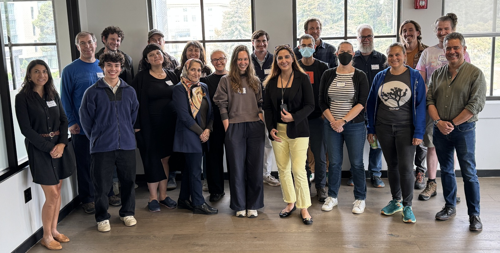

Last week, roughly 25 GeoJupyter contributors gathered in Berkeley, CA for a 2-day
hackathon and demonstrated what makes open source communities so special.

Thank you _so much_ to our wonderful hackathon participants for bringing a collaborative
energy that made it fun to take on hard problems!
With backgrounds and skills all over the spectrum, everyone had something to teach and
something to learn, creating a multiplier effect where our diverse expertise amplified
others' contributions.

{.lightbox}

## What made this event special

Because of our diverse experience and expertise, we worked on diverse problems.
Some of us jumped in to immediate fixes, like documentation improvements.
Others explored experimental API enhancements, like providing a way to alter layer
properties from Python.
And some moved 10 steps back and asked fundamental questions like "What is JupyterGIS?
What is it **not**?"

In exploring these problems, our participants created a supportive atmosphere, enabling
everyone to comfortably contribute their unique expertise.

A fantastic team of facilitators from 
[Berkeley Institute for Data Science (BIDS)](https://bids.berkeley.edu) and
[Schmidt Center for Data Science and Environment (DSE)](https://dse.berkeley.edu)
curated equipment and a comfortable environment, solved problems, provided delicious
caffeine and meals, and more.

## What we accomplished

### Development infrastructure

* Worked together to set up development environments for the first time
* Explored using devcontainers to reduce startup burden for new contributors

  > This is an interoperable development container that automates the dev environment
  > setup for jupytergis development, which works both on Hub infrastructure as well as on
  > VSCode / Codespaces without any additional tinkering!
  > This means that users, regardless of their host OS, can build and iterate on
  > JupyterGIS either locally (using Docker or Docker + VSCode) or in the cloud (on
  > managed Hub infrastructure or GitHub codespaces).
  > A byproduct of this work was the development of a
  > [Dev Container Feature](https://github.com/GondekNP/devcontainer_jupyterhub_interoperator)
  > that provides a way for Jupyter-based images to play nice with `devcontainer`-based
  > tools without fuss, something I have been annoyed with for some time.

* Discussed the potential of using a JupyterHub for developing on JupyterLab extensions

### Documentation

> Our hackathon topic brought together a diverse set of backgrounds and personas of
> potential JupyterGIS users to test out and improve existing documentation and
> tutorials.
> Several pull requests, bug reports and feature suggestions were created and the
> JupyterGIS project gained another 9 testers.
> Repeating this experiment by giving this task to different types of user working
> groups is one great way to help build a roadmap and envision the future of this
> project. 

* Tested JupyterGIS and reported bugs 
  ([#869](https://github.com/geojupyter/jupytergis/issues/869))
* Suggested new features
  ([#871](https://github.com/geojupyter/jupytergis/issues/871),
  [#876](https://github.com/geojupyter/jupytergis/issues/876))
* Updated the structure of the JupyterGIS examples with a "guided tour" feel
  ([#872](https://github.com/geojupyter/jupytergis/pull/872),
  [#878](https://github.com/geojupyter/jupytergis/pull/878)
  [#875](https://github.com/geojupyter/jupytergis/issues/875))
* Tested JupyterGIS tutorials for accuracy and clarity, and submitted fixes
  ([#873](https://github.com/geojupyter/jupytergis/pull/873))
* Reviewed documentation prose and inline documentation (like docstrings) for clarity
  and errors, and submitted fixes!
  ([#874](https://github.com/geojupyter/jupytergis/pull/874),
  [#867](https://github.com/geojupyter/jupytergis/pull/867),
  [#868](https://github.com/geojupyter/jupytergis/pull/868),
  [#873](https://github.com/geojupyter/jupytergis/pull/873),
  [#864](https://github.com/geojupyter/jupytergis/pull/864))

### Python API ergonomics

> We worked on getting data out of the map layer, manipulating the data and making
> updates to the map.
> We showed this was possible through two different workflows: toggling layer visibility
> and getting geojson from layer source and turning it into a geopandas object.

Please see [#877](https://github.com/geojupyter/jupytergis/pull/877) for more!

### "What is/is not JupyterGIS?"

> We followed a detailed user story focused on biodiversity and identified some gaps and
> opportunities.
> We thought about what problems JupyterGIS should and should not try to solve and
> identified overlap with things Notebooks are good at and many researchers are
> comfortable doing in Notebooks -- analysis.
> By focusing more on visualization, an area where many practitioners already struggle
> and a reason they open QGIS, we feel we can more quickly deliver a product that can be
> used in daily work.
> We also identified a robust STAC search implementation and GUI as something
> alternatives do not excel at, and a possible "killer feature".

* Why do people leave QGIS?
    * Scaling analyses or performing analysis on big datasets
    * Repeatability & reproducibility with a Notebook or script
* Why do people come back to QGIS?
    * Exploring results
    * Making a map to share or tell a story

## (WIP) Lessons for future events

* Get the keys for the network closet!
  Sometimes all we need to fix the wifi is to reboot the router.
* Did we time the design discussion well?
  Should it have been earlier in the event timeline?
  On one hand, we had time to acclimate to the project beforehand.
  On the other, the design discussion influenced how we worked afterwards.
* TODO: More!

## (TODO) Call to join the community

---

_Special thanks to [Berkeley Institute for Data Science (BIDS)](https://bids.berkeley.edu) for hosting us on day 1!_
