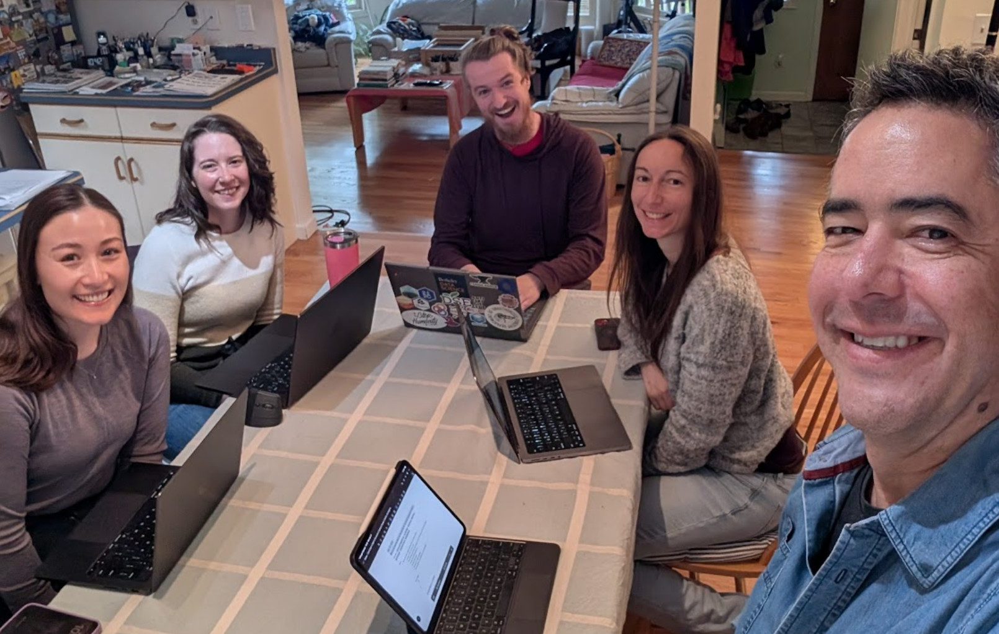

In April 2026, Fernando Pérez delivered a talk at the Colorado School of Mines Heiland
Lecture Series that told the story of the history of Project Jupyter and the open
science movement, overviewed the power of the Jupyter architecture, and live-demoed
four example workflows that integrate free ("open-weights") Large Language Models
(LLMs) to lower barriers to insights.

Core to this talk is the idea that many of the tools and practices we depend on today
evolved from a community-wide refusal, 25 years ago, to accept a future where computing
was dominated by proprietary products and services.
That's why you're probably writing Python instead of MATLAB today.
We may be in a similar moment today: so why are many of us begging our tech overlords
for API credits?

Instead, let's co-create a future in which our work is supported by models that we fully
control, our data doesn't need to leave our home or office, and we aren't paying rent to
do our job.

You can watch Fernando's talk on YouTube below, and **read on to learn about how we
built the demos together**.



## Dream team!

Designing for these demos involved a group gathering, both virtual and in-person in
Boulder, Colorado, to co-work on software design & development, infrastructure prep,
local model evaluation, and pushing the limits of the new v3 release of
[Jupyter AI](https://jupyter-ai.readthedocs.io/).

Virtual collaborators not shown: Brian Granger, Min Ragan-Kelley, Carl Boettiger, and
possibly more.
